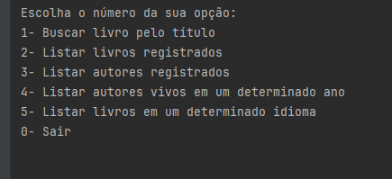

# 💻 Projeto Literalura 📚

> Projeto desenvolvido como desafio para Alura

> O objetivo do projeto é criar um programa que você pesquise por livros ( se conectamdp a uma API externa [GUTENDEX](https://gutendex.com/) ) via CLI usando o framwework Java - SpringBoot.

## Acesso

O site pode ser acesso através do link:

[Link em Breve]()

## Tecnologias e Ferramentas

  - Java
  - [IntelliJ IDEA](https://www.jetbrains.com/idea/)
  - [Jackson Data Bind](https://github.com/FasterXML/jackson-databind)

  - [Spring Boot](https://spring.io/projects/spring-boot)
  - [Postgres](https://www.postgresql.org/)

## ☕ Características

1. A aplicação permite que o usuário busque por um titulo de livro com o autor.
2. Assim que é encontrado um livro, ele é imediatamente armazenado no Banco de dados postgres.
3. A partir dessa pesquisa e gravação, todas as proximas funcionalidades são diretamente solicitadas ao banco via JPA( Hibernate ) e não mais a API externa.
4. Foi utilizado funcionalidades como Enum e Data Access Object (DTO)/Record com a finalidade de legibilidade, previsibilidade e Serialização/Deserialização.
5. Foi utlizada a biblioteca Jackson para conversão entre estruturas de dados (JSON <=> Java Object).
6. A organinação do projeto foi baseada no modelo MVC que é usado na web.

## 📝 Licença

Esse projeto está sob licença. Veja o arquivo [LICENÇA]() para mais detalhes.
