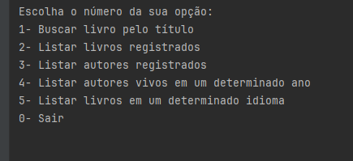
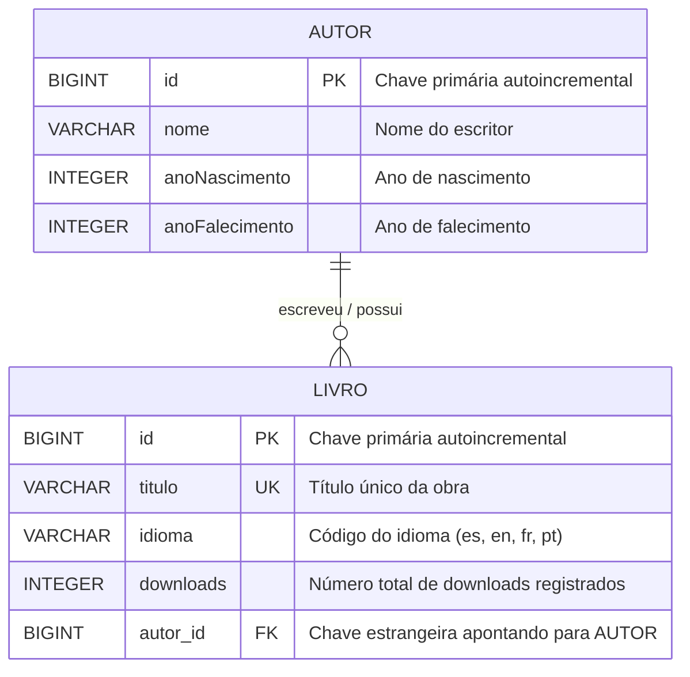
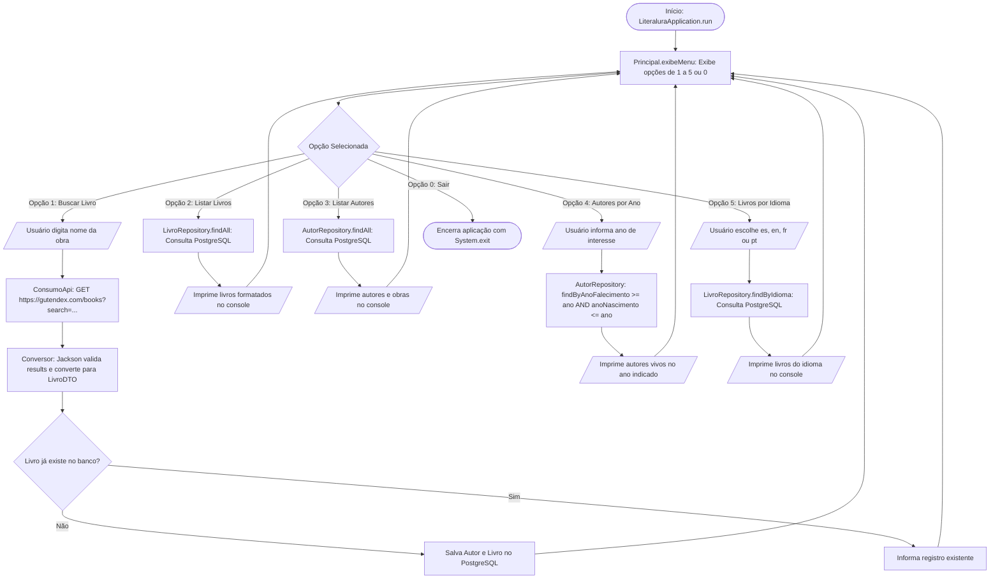

# 💻 Projeto Literalura 📚

<br />

<div align="center">
  
</div>

<br />

<div align="center">

[](https://www.oracle.com/java/)
[](https://spring.io/projects/spring-boot)
[](https://spring.io/projects/spring-data-jpa)
[](https://www.postgresql.org/)
[](https://github.com/FasterXML/jackson-databind)
[](https://gutendex.com/)
[](https://www.alura.com.br/)
[](LICENSE)
[](#)

</div>

---

> Projeto desenvolvido como desafio para **Alura** no âmbito do programa **Oracle Next Education (ONE)**.
> 
> O objetivo do projeto é criar um catálogo literário interativo via linha de comando (CLI) que busca livros consumindo a API externa **[GUTENDEX](https://gutendex.com/)**, persistindo os dados em banco relacional **PostgreSQL** através do ecossistema **Java com Spring Boot 3**.

---

## 🔗 Acesso e Execução

A aplicação é executada diretamente no terminal através da interface de linha de comando (`CommandLineRunner`), conectando-se à base de dados PostgreSQL e realizando requisições à API pública do Gutendex.

---

## 📖 Visão Geral

O **Literalura** é um catálogo e buscador de obras literárias de domínio público que une o poder do **Spring Boot** para aplicações de console (*CLI*) à persistência com **Spring Data JPA**.

O fluxo principal opera sob uma estratégia híbrida inteligente:
1. Ao pesquisar um novo título, o sistema consulta a API web do **Gutendex**.
2. Os dados recebidos em JSON são filtrados e convertidos em entidades de domínio (`Livro` e `Autor`).
3. Uma vez armazenados no banco de dados local **PostgreSQL**, todas as consultas e análises posteriores (como filtragem por idioma e autores vivos em determinado período histórico) são processadas diretamente no banco de dados com queries derivadas do Spring Data JPA, sem sobrecarregar a API externa.

---

## ✨ Funcionalidades

* **1. Buscar livro pelo título:**
  * Solicita o nome da obra, sanitiza a entrada com codificação de URL (`URLEncoder.encode(..., UTF-8)`) e realiza busca HTTP na Gutendex API.
  * Valida se houve resultados no nó `results` da resposta JSON.
  * Persiste o autor de forma preventiva para evitar duplicações e vincula a obra ao autor no banco de dados PostgreSQL.
* **2. Listar livros registrados:**
  * Recupera e exibe no console todos os livros salvos no banco local, apresentando título, autor correspondente, idioma e total de downloads.
* **3. Listar autores registrados:**
  * Consulta todos os autores catalogados na base, exibindo ano de nascimento, ano de falecimento e a lista de livros associados.
* **4. Listar autores vivos em um determinado ano:**
  * Executa busca temporal no banco de dados através da query derivada `findByAnoFalecimentoGreaterThanEqualAndAnoNascimentoLessThanEqual`, identificando quais escritores estavam vivos no ano especificado pelo usuário.
* **5. Listar livros em um determinado idioma:**
  * Filtra as obras cadastradas pelo código do idioma selecionado no menu (`es` - Espanhol, `en` - Inglês, `fr` - Francês, `pt` - Português).
* **0. Sair:**
  * Encerra com segurança a execução da aplicação e libera a conexão com o banco de dados.

---

## 🎯 Diferenciais e Destaques Técnicos

1. **DTOs Imutáveis com Java Records:**
   * Utilização de Records (`LivroDTO` e `AutorDTO`) com anotações do Jackson (`@JsonIgnoreProperties(ignoreUnknown = true)` e `@JsonProperty("birth_year")`, `@JsonProperty("death_year")`, `@JsonProperty("download_count")`), garantindo segurança contra campos inesperados do payload JSON.
2. **Prevenção Ativa de Duplicações Cadastrais:**
   * O método `AutorService.salvarAutor` verifica com `findByNomeAndAnoNascimento` se o autor já existe no banco antes de persistir uma nova entidade.
   * O método `LivroService.salvarLivro` utiliza a restrição de chave única `@Column(unique = true)` e a checagem com `findByTituloAndAutor_Nome`.
3. **Mapeamento Objeto-Relacional Bidirecional:**
   * Relacionamento `@OneToMany(mappedBy = "autor", fetch = FetchType.EAGER, cascade = CascadeType.ALL)` em `Autor` e `@ManyToOne` em `Livro`, assegurando sincronismo entre os dois lados da associação.
4. **Tipagem Segura de Idiomas com Enum:**
   * O enum `Idioma` mapeia os códigos oficiais da API (`es`, `en`, `fr`, `pt`) com método utilitário `Idioma.porCodigo(...)`, persistido como String no PostgreSQL (`@Enumerated(EnumType.STRING)`).
5. **Cliente HTTP Nativo do Java (`java.net.http.HttpClient`):**
   * Configuração de redirecionamento automático com `followRedirects(HttpClient.Redirect.ALWAYS)` no serviço `ConsumoApi`.

---

## 🏗️ Arquitetura do Projeto

O projeto segue os princípios de separação de responsabilidades em camadas do Spring:

```bash
Literalura/
├── .mvn/wrapper/                              # Binários do Maven Wrapper
├── mvnw                                       # Executável Maven Wrapper para Linux/macOS
├── mvnw.cmd                                   # Executável Maven Wrapper para Windows
├── pom.xml                                    # Manifesto de dependências e plugins do Maven
├── README.md                                  # Documentação técnica do projeto
├── Snapshot.PNG                               # Evidência visual do menu em execução no terminal
└── src/
    ├── main/
    │   ├── java/dev/erickystn/literalura/
    │   │   ├── LiteraluraApplication.java     # Classe de inicialização (CommandLineRunner)
    │   │   ├── dto/                           # Data Transfer Objects (Records)
    │   │   │   ├── AutorDTO.java              # Mapeamento do autor no JSON da Gutendex
    │   │   │   └── LivroDTO.java              # Mapeamento do livro e downloads no JSON
    │   │   ├── model/                         # Entidades de domínio JPA
    │   │   │   ├── Autor.java                 # Entidade do autor com datas de vida e livros
    │   │   │   ├── Idioma.java                # Enum com os idiomas suportados (es, en, fr, pt)
    │   │   │   └── Livro.java                 # Entidade do livro com título, idioma e autor
    │   │   ├── principal/                     # Camada de apresentação e interação de console
    │   │   │   └── Principal.java             # Menu interativo, captura de inputs e loop CLI
    │   │   ├── repository/                    # Interfaces de acesso a dados (Spring Data JPA)
    │   │   │   ├── AutorRepository.java       # Queries para autores e busca por ano
    │   │   │   └── LivroRepository.java       # Queries para livros e busca por idioma
    │   │   └── service/                       # Camada de lógica de negócio e integração
    │   │       ├── AutorService.java          # Regras de persistência e validação de autores
    │   │       ├── ConsumoApi.java            # Cliente HTTP nativo para chamadas à Gutendex API
    │   │       ├── Conversor.java             # Desserialização de nós JSON com Jackson
    │   │       ├── IConverteDados.java        # Interface de contrato genérico de conversão
    │   │       └── LivroService.java          # Regras de persistência e buscas de livros
    │   └── resources/
    │       └── application.properties         # Configuração de conexão com o PostgreSQL e Hibernate
    └── test/
        └── java/dev/erickystn/literalura/
            └── LiteraluraApplicationTests.java # Testes de contexto do Spring Boot
```

---

## 📊 Modelagem de Dados

### Diagrama Entidade-Relacionamento (DER)


```mermaid
erDiagram
    AUTOR {
        BIGINT id PK "Chave primária autoincremental"
        VARCHAR nome "Nome do escritor"
        INTEGER anoNascimento "Ano de nascimento"
        INTEGER anoFalecimento "Ano de falecimento"
    }

    LIVRO {
        BIGINT id PK "Chave primária autoincremental"
        VARCHAR titulo UK "Título único da obra"
        VARCHAR idioma "Código do idioma (es, en, fr, pt)"
        INTEGER downloads "Número total de downloads registrados"
        BIGINT autor_id FK "Chave estrangeira apontando para AUTOR"
    }

    AUTOR ||--o{ LIVRO : "escreveu / possui"
```

---

## 🔄 Fluxo de Execução e Integração

O diagrama abaixo detalha a interação entre o usuário, o cliente HTTP externo e o repositório PostgreSQL:


```mermaid
flowchart TD
    A([Início: LiteraluraApplication.run]) --> B[Principal.exibeMenu: Exibe opções de 1 a 5 ou 0]
    B --> C{Opção Selecionada}

    C -- Opção 1: Buscar Livro --> D[/Usuário digita nome da obra/]
    D --> E[ConsumoApi: GET https://gutendex.com/books?search=...]
    E --> F[Conversor: Jackson valida results e converte para LivroDTO]
    F --> G{Livro já existe no banco?}
    G -- Não --> H[Salva Autor e Livro no PostgreSQL]
    G -- Sim --> I[Informa registro existente]
    H --> B
    I --> B

    C -- Opção 2: Listar Livros --> J[LivroRepository.findAll: Consulta PostgreSQL]
    J --> K[/Imprime livros formatados no console/]
    K --> B

    C -- Opção 3: Listar Autores --> L[AutorRepository.findAll: Consulta PostgreSQL]
    L --> M[/Imprime autores e obras no console/]
    M --> B

    C -- Opção 4: Autores por Ano --> N[/Usuário informa ano de interesse/]
    N --> O[AutorRepository: findByAnoFalecimento >= ano AND anoNascimento <= ano]
    O --> P[/Imprime autores vivos no ano indicado/]
    P --> B

    C -- Opção 5: Livros por Idioma --> Q[/Usuário escolhe es, en, fr ou pt/]
    Q --> R[LivroRepository.findByIdioma: Consulta PostgreSQL]
    R --> S[/Imprime livros do idioma no console/]
    S --> B

    C -- Opção 0: Sair --> T([Encerra aplicação com System.exit])
```

---

## 🌐 Consumo da API Gutendex e Auditoria de Segurança

* **Endpoint Externo:** `https://gutendex.com/books?search={titulo}`
* **Codificação de Parâmetros:** Uso de `URLEncoder.encode(termo, StandardCharsets.UTF_8)` para garantir que caracteres especiais, espaços e acentuações não corrompam a URI de consulta.
* **Tratamento de Exceções de Rede:** Captura de `IOException` e `InterruptedException` com relançamento em `RuntimeException(e)` devidamente controlado.
* **Segurança de Credenciais:** As credenciais de banco em `application.properties` devem ser isoladas através de variáveis de ambiente em ambientes de produção (`${DB_HOST}`, `${DB_USER}`, `${DB_PASSWORD}`).

---

## ⚙️ Requisitos e Instalação

### Pré-requisitos
* **Java Development Kit (JDK):** Versão 17 LTS ou 21 instalada.
* **PostgreSQL:** Banco de dados PostgreSQL 12+ em execução (com a base de dados criada, por exemplo `alura_series` ou `literalura_db`).
* **Git:** Para clonagem e versionamento.

### Configuração do Banco de Dados
Certifique-se de que o PostgreSQL esteja em execução e configure o arquivo `src/main/resources/application.properties` com suas credenciais:

```properties
spring.application.name=literalura
spring.datasource.url=jdbc:postgresql://localhost:5432/alura_series
spring.datasource.username=seu_usuario
spring.datasource.password=sua_senha
spring.datasource.driver-class-name=org.postgresql.Driver
spring.jpa.hibernate.ddl-auto=update
```

---

## 🚀 Como Executar

1. Clone o repositório em seu ambiente:
```bash
git clone https://github.com/erickystn/Literalura.git
```

2. Acesse a pasta do projeto:
```bash
cd Literalura
```

3. Execute a aplicação utilizando o Maven Wrapper:
```bash
# Linux / macOS
./mvnw spring-boot:run

# Windows
mvnw.cmd spring-boot:run
```

---

## 💻 Exemplos de Código

### 1. DTO com Jackson e Records (`src/main/java/dev/erickystn/literalura/dto/LivroDTO.java`)
```java
package dev.erickystn.literalura.dto;

import com.fasterxml.jackson.annotation.JsonIgnoreProperties;
import com.fasterxml.jackson.annotation.JsonProperty;
import java.util.List;

@JsonIgnoreProperties(ignoreUnknown = true)
public record LivroDTO(
        String title,
        List<String> languages,
        List<AutorDTO> authors,
        @JsonProperty("download_count") Integer downloads
) {
}
```

---

### 2. Query Derivada para Busca Temporal de Autores (`AutorRepository.java`)
```java
public interface AutorRepository extends JpaRepository<Autor, Long> {
    List<Autor> findByAnoFalecimentoGreaterThanEqualAndAnoNascimentoLessThanEqual(Integer anoMorte, Integer anoNascimento);
    Optional<Autor> findByNomeAndAnoNascimento(String nome, Integer dataNascimento);
}
```

---

## 🧪 Suíte de Testes

O projeto conta com o starter de testes do Spring Boot (`spring-boot-starter-test`) com **JUnit 5**:

```bash
./mvnw test
```

---

## 🛠️ Tecnologias Utilizadas

| Tecnologia | Versão | Função na Aplicação |
| :--- | :--- | :--- |
| **[Java](https://www.oracle.com/java/)** | 21 / 17 LTS | Linguagem de programação principal utilizada no desenvolvimento da lógica de negócio. |
| **[Spring Boot](https://spring.io/projects/spring-boot)** | 3.3.5 | Framework base para configuração e execução de aplicações Java standalone. |
| **[Spring Data JPA](https://spring.io/projects/spring-data-jpa)** | — | Camada de abstração e persistência de dados sobre o Hibernate. |
| **[PostgreSQL](https://www.postgresql.org/)** | — | Sistema gerenciador de banco de dados relacional para persistência de livros e autores. |
| **[Jackson Databind](https://github.com/FasterXML/jackson-databind)** | 2.18.1 | Biblioteca para serialização e desserialização de JSON em objetos Java e Records. |
| **[Gutendex API](https://gutendex.com/)** | Web API | API pública externa com catálogo de livros do Projeto Gutenberg. |
| **[Apache Maven](https://maven.apache.org/)** | 3.9.9 (Wrapper) | Gerenciador de ciclo de vida de compilação, dependências e empacotamento. |

---

## 📈 Melhorias e Próximos Passos (Roadmap)

- [ ] **Estatísticas Avançadas com DoubleSummaryStatistics:** Implementar opção no menu para exibir média, máximo e mínimo de downloads das obras registradas.
- [ ] **Top 10 Livros Mais Baixados:** Query com `LIMIT 10` e ordenação decrescente de downloads (`ORDER BY downloads DESC`).
- [ ] **Suporte a Busca por Nome do Autor na API:** Permitir pesquisa direta por escritor na base do Gutendex.
- [ ] **Migração de Credenciais para Variáveis de Ambiente:** Utilizar `${DB_HOST}` e `${DB_PASSWORD}` para mitigar credenciais em texto plano.

---

## 🤝 Como Contribuir

1. Faça um **Fork** do repositório.
2. Crie uma branch com a sua contribuição:
   ```bash
   git checkout -b feature/minha-melhoria
   ```
3. Commit suas alterações seguindo o padrão de commits semânticos:
   ```bash
   git commit -m "feat: adiciona calculo estatistico de downloads com DoubleSummaryStatistics"
   ```
4. Envie suas alterações para o seu repositório remoto:
   ```bash
   git push origin feature/minha-melhoria
   ```
5. Abra um **Pull Request** detalhando a implementação.

---

## 👤 Autor & Créditos

* **Desenvolvedor:** [Ericky Sant'ana](https://github.com/erickystn)
* **Formação e Desafio:** Desafio do programa **Oracle Next Education (ONE)** em parceria com a [Alura](https://www.alura.com.br/).
* **Provedor de Dados Literários:** [Projeto Gutenberg](https://www.gutenberg.org/) via [Gutendex API](https://gutendex.com/).

---

## 📄 Licença

Este projeto está licenciado sob a licença **MIT**. Para mais detalhes, consulte o arquivo de licença ou utilize o código livremente para propósitos educacionais e acadêmicos.
